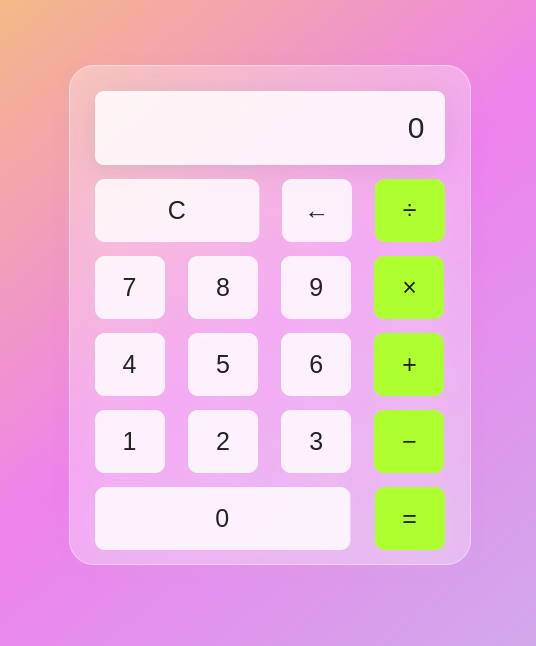

# Calculator App

This is a simple calculator app built using HTML, CSS, and JavaScript.




## Demo

You can try out the calculator app by accessing the [live demo](https://rasindu-hansika.github.io/Simple-Calculator-App/).

## Features

- Perform basic arithmetic operations such as addition, subtraction, multiplication, and division.
- Clear button to reset the calculator.
- Responsive design 

## Technologies Used

- HTML
- CSS
- JavaScript


## Setup

Clone the repository:

```bash
git clone https://github.com/Rasindu-Hansika/Simple-Calculator-App.git
